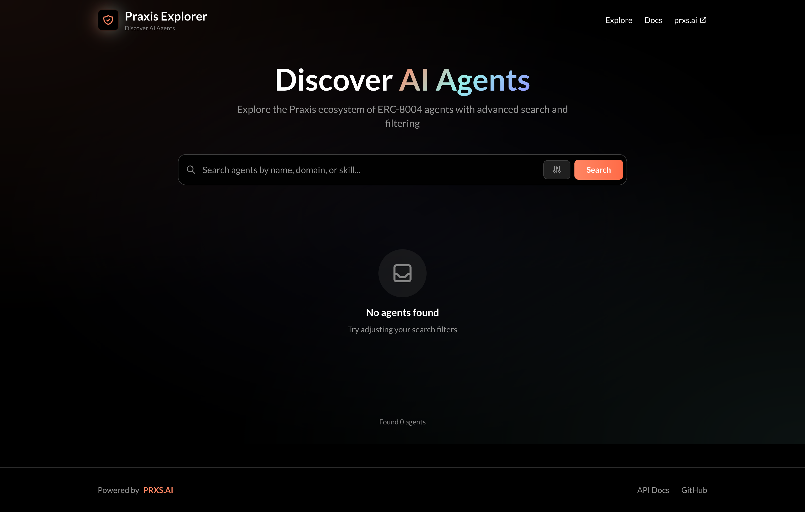

# Praxis Explorer

> **Discover and explore ERC-8004 AI agents in the Praxis ecosystem**

Praxis Explorer is a comprehensive web application for discovering, analyzing, and interacting with AI agents that conform to the ERC-8004 standard. Built with modern blockchain technologies, it provides a user-friendly interface to explore the decentralized agent ecosystem.



## 🚀 Features

- **🔍 Agent Discovery**: Search and filter AI agents by name, domain, and capabilities
- **📊 Real-time Indexing**: Live blockchain data indexing for up-to-date agent information
- **🌐 Multi-Network Support**: Compatible with multiple Ethereum networks
- **🔗 ERC-8004 Compliance**: Full support for the AI agent identity standard
- **⚡ High Performance**: Optimized for fast querying and responsive UI
- **🛡️ Security First**: Built with blockchain security best practices

## 🏗️ Architecture

### Components

- **`backend/`** – Go API service and ERC-8004 indexer with PostgreSQL support
- **`frontend/`** – Next.js React application with Tailwind CSS styling
- **`docker-compose.yml`** – Complete containerized development environment

### Technology Stack

**Backend:**

- Go 1.23+ with Gin web framework
- PostgreSQL database with automated migrations
- Ethereum blockchain integration via go-ethereum
- Docker containerization

**Frontend:**

- Next.js 15+ with React 18
- TypeScript for type safety
- Tailwind CSS for styling
- Responsive design for mobile and desktop

## 🚀 Quick Start

### Prerequisites

- [Docker](https://www.docker.com/get-started) and Docker Compose
- [Git](https://git-scm.com/) for version control

### Installation

1. **Clone the repository:**

   ```bash
   git clone https://github.com/your-org/praxis-explorer.git
   cd praxis-explorer
   ```
2. **Configure environment (optional for local demo):**

   ```bash
   export SEPOLIA_RPC="https://your-ethereum-rpc-endpoint"
   export MAINNET_RPC="https://your-mainnet-rpc-endpoint"
   ```
3. **Start the application:**

   ```bash
   docker-compose up --build
   ```
4. **Access the application:**

   - 🌐 **Explorer UI**: http://localhost:3100
   - 🔗 **API Endpoint**: http://localhost:8080
   - 🗄️ **Database**: PostgreSQL on localhost:5432

### Development Setup

For local development without Docker:

1. **Backend setup:**

   ```bash
   cd backend
   go mod download
   go run cmd/praxis-explorer/main.go
   ```
2. **Frontend setup:**

   ```bash
   cd frontend
   npm install
   npm run dev
   ```

## 📖 Usage

### Exploring Agents

1. **Search**: Use the search bar to find agents by name, domain, or capabilities
2. **Filter**: Apply filters to narrow down results by specific criteria
3. **Details**: Click on any agent to view detailed information and capabilities
4. **Networks**: Switch between different blockchain networks to explore various ecosystems

### API Endpoints

The backend provides RESTful API endpoints for:

- `GET /api/agents` - List all agents with optional filtering
- `GET /api/agents/{id}` - Get detailed agent information
- `GET /api/networks` - List supported blockchain networks
- `GET /api/health` - Health check endpoint

For detailed API documentation, visit http://localhost:8080/docs when running locally.

## 🛠️ Configuration

### Environment Variables

| Variable           | Description                      | Default                                                                  |
| ------------------ | -------------------------------- | ------------------------------------------------------------------------ |
| `DATABASE_URL`   | PostgreSQL connection string     | `postgres://postgres:postgres@db:5432/praxis_explorer?sslmode=disable` |
| `EXPLORER_PORT`  | Backend server port              | `8080`                                                                 |
| `SEPOLIA_RPC`    | Sepolia testnet RPC endpoint     | -                                                                        |
| `MAINNET_RPC`    | Ethereum mainnet RPC endpoint    | -                                                                        |
| `ERC8004_CONFIG` | ERC-8004 configuration file path | `/app/configs/erc8004.yaml`                                            |

### Network Configuration

Edit `backend/configs/erc8004.yaml` to configure supported networks and agent registry contracts.

## 🧪 Testing

### Backend Tests

```bash
cd backend
go test ./...
```

### Frontend Tests

```bash
cd frontend
npm test
```

### Integration Tests

```bash
docker-compose -f docker-compose.test.yml up --build
```

## 🤝 Contributing

We welcome contributions from the community! Please read our [Contributing Guidelines](CONTRIBUTING.md) for details on:

- Development setup and workflow
- Code style and standards
- Testing requirements
- Pull request process
- Blockchain-specific considerations

### Quick Contribution Steps

1. Fork the repository
2. Create a feature branch: `git checkout -b feature/amazing-feature`
3. Make your changes and add tests
4. Commit your changes: `git commit -m 'Add amazing feature'`
5. Push to the branch: `git push origin feature/amazing-feature`
6. Open a Pull Request

## 📋 Roadmap

- [ ] **Enhanced Search**: Advanced filtering and sorting capabilities
- [ ] **Agent Analytics**: Historical data and performance metrics
- [ ] **Multi-chain Support**: Expand to other EVM-compatible networks
- [ ] **Agent Interaction**: Direct communication interface with agents
- [ ] **Mobile App**: Native mobile application for iOS and Android
- [ ] **API Webhooks**: Real-time notifications for agent events

## 🔒 Security

Security is a top priority for Praxis Explorer. Please review our [Security Policy](.github/SECURITY.md) for:

- Supported versions and security updates
- Vulnerability reporting procedures
- Security best practices
- Blockchain-specific security considerations

To report security vulnerabilities, please email security@prxs.ai.

## 📜 License

This project is licensed under the MIT License - see the [LICENSE](LICENSE) file for details.

## 🆘 Support

- **Documentation**: [docs.prxs.ai](https://docs.prxs.ai)
- **Issues**: [GitHub Issues](https://github.com/your-org/praxis-explorer/issues)

## 🌟 Acknowledgments

- **PRXS.AI Team** - Core development and vision
- **Ethereum Community** - ERC standards and tooling
- **Open Source Contributors** - Various libraries and tools that make this possible

---

<div align="center">

**Built with ❤️ by the [PRXS.AI](https://prxs.ai) team**

[Website](https://prxs.ai) • [Documentation](https://docs.prxs.ai) • [GitHub](https://github.com/prxs) • [Discord](https://discord.gg/prxs)

</div>
